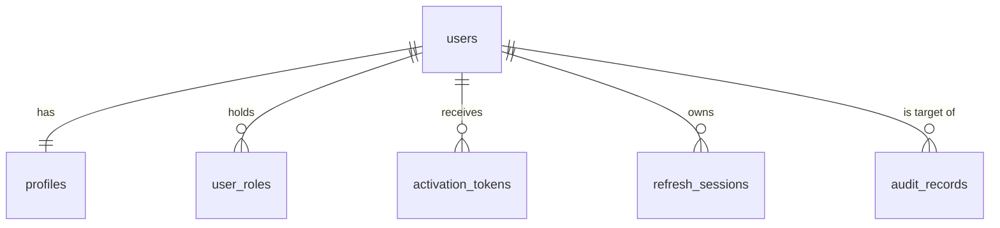

# User Service — Database Choice and Schema

D2 §2. Backlog refs: US-FR1.1.1, US-FR3.1, US-FR4.1.2, US-NFR2.1.1, US-NFR2.1.2, US-NFR4.1.2.
Ticket: USR-01 (#120).

## 1. Database: PostgreSQL

**Why, for FoC specifically**

- **The data is relational and constraint-heavy.** Email uniqueness, one profile per user, sessions
  belonging to a user, audit rows referring to both actor and target. Unique indexes and foreign keys
  enforce these in the database instead of trusting application code.
- **The hard rules need transactions.** Activation is single-use (consume the token and flip the status
  atomically). "At least one admin always exists" needs a locked read-check-write. Suspension must revoke
  refresh sessions and write the audit row together. All of these are single-database ACID operations.
- **Query patterns are simple and indexed.** By `id` (lookup), by normalized `email` (login/register), by
  `token_hash` (activation, refresh), and paginated admin listing filtered by status/role. All are B-tree hits.
- **Scale is small.** One campus's students, on the order of 10⁴ accounts, and a few writes per second at
  peak. No sharding or document flexibility is needed; a single primary is enough.
- **Team consistency.** Credit and Order services need ACID for the ledger and saga; one engine means one
  Compose service (separate logical databases and credentials per service, plan §3.1) and one skill set.

**Considered and rejected:** MongoDB — schema flexibility isn't needed for a fixed identity model and it
weakens the uniqueness and cross-row invariants above; Redis — session cache only, not a system of record;
a hosted identity provider — would hide the RBAC and credential storage the course asks us to explain.

## 2. Schema

Forward-only migrations. All ids are UUID; all timestamps are `timestamptz` (UTC).
`email` is stored already normalized (trimmed, lower-cased) and protected by a unique index on `lower(email)`, so uniqueness holds even if a row is ever written without going through the service.

### `users`
| Column              | Type          | Notes                                                                       |
| ------------------- | ------------- | --------------------------------------------------------------------------- |
| `id`                | uuid PK       | Never editable. Generated server-side.                                       |
| `email`             | text NOT NULL, UNIQUE index on `lower(email)` | Normalized. Duplicate → rejected, no row created. |
| `password_hash`     | text NOT NULL | Argon2id, encoded string including the per-hash random salt and parameters. |
| `status`            | text NOT NULL | `CHECK IN ('PENDING_ACTIVATION','ACTIVE','SUSPENDED')`                       |
| `is_seeded_admin`   | boolean NOT NULL DEFAULT false | Set only by the boot seed. Never writable through any API. |
| `activated_at`      | timestamptz NULL | Set once, on first activation. Drives "exactly one `UserActivated`".      |
| `created_at`, `updated_at` | timestamptz NOT NULL |                                                                    |

### `user_roles`
| Column       | Type        | Notes                                                    |
| ------------ | ----------- | -------------------------------------------------------- |
| `user_id`    | uuid FK → users ON DELETE RESTRICT | PK (`user_id`, `role`)            |
| `role`       | text        | `CHECK IN ('STUDENT','ADMIN')`                            |
| `granted_by` | uuid FK → users NULL | Null for seed and for the implicit `STUDENT` role |
| `granted_at` | timestamptz |                                                           |

Every user has a `STUDENT` row from creation. Promotion adds an `ADMIN` row; demotion deletes it (inside a
transaction that first checks the remaining admin count under `SELECT … FOR UPDATE`).

### `profiles`
| Column               | Type         | Notes                                                      |
| -------------------- | ------------ | ---------------------------------------------------------- |
| `user_id`            | uuid PK FK → users | 1:1                                                  |
| `display_name`       | text NOT NULL | 1–50 chars                                                |
| `faculty`            | text NULL    |                                                            |
| `avatar_ref`         | text NULL    | Reference (opaque key or URL), not image bytes            |
| `contact_preference` | text NOT NULL DEFAULT 'IN_APP' | `IN_APP` \| `EMAIL`                    |
| `preferred_mode`     | text NOT NULL DEFAULT 'REQUESTER' | `REQUESTER` \| `COURIER`. UX only — never read by any authorization decision. |

### `activation_tokens`
| Column        | Type        | Notes                                                       |
| ------------- | ----------- | ----------------------------------------------------------- |
| `id`          | uuid PK     |                                                             |
| `user_id`     | uuid FK     |                                                             |
| `token_hash`  | text UNIQUE | Hex SHA-256 of a 256-bit random token; the raw token exists only in the email |
| `expires_at`  | timestamptz | e.g. 24 h                                                   |
| `consumed_at` | timestamptz NULL | Set in the same transaction that activates the user   |

### `refresh_sessions`
| Column        | Type        | Notes                                                                 |
| ------------- | ----------- | --------------------------------------------------------------------- |
| `id`          | uuid PK     | Also the token's session id (`sid` claim in the access token)          |
| `family_id`   | uuid        | Shared by every token descended from one login                         |
| `user_id`     | uuid FK     | Index on (`user_id`)                                                   |
| `token_hash`  | text UNIQUE | Hex SHA-256 of the opaque refresh token                                |
| `issued_at`, `expires_at` | timestamptz | `expires_at` = issue + 7 days                          |
| `rotated_at`  | timestamptz NULL | Set when this token is exchanged for a new one                    |
| `revoked_at`  | timestamptz NULL | Logout, suspension, or family kill                                |

**Reuse detection:** presenting a token whose `rotated_at` is set revokes every row with the same
`family_id`.

### `audit_records` (append-only)
| Column           | Type        | Notes                                                        |
| ---------------- | ----------- | ------------------------------------------------------------ |
| `id`             | uuid PK     | Also the "reason reference" carried in `UserSuspended`        |
| `actor_id`       | uuid        |                                                              |
| `target_user_id` | uuid        |                                                              |
| `action`         | text        | `SUSPEND` \| `REACTIVATE` \| `ROLE_GRANT` \| `ROLE_REVOKE`     |
| `reason`         | text        | Required, 1–500 chars                                         |
| `occurred_at`    | timestamptz |                                                              |
| `correlation_id` | text        |                                                              |

Append-only is enforced twice: the service's DB role has `INSERT, SELECT` only (no `UPDATE`/`DELETE`),
and a trigger raises on any `UPDATE` or `DELETE`. No API edits or deletes an audit row.

### `outbox_events`
| Column | Type | Notes |
| --- | --- | --- |
| `id` | uuid PK | |
| `event_type` | text | `UserActivated`, later `UserSuspended` / `UserReactivated` |
| `aggregate_id` | uuid | the user |
| `payload` | jsonb | |
| `correlation_id` | text | |
| `occurred_at` | timestamptz | |
| `published_at` | timestamptz NULL | set by the publisher once the broker has confirmed |

Events are inserted in the same transaction as the change that caused them, so an activation can never
commit without its event. EVT-02 (Jonus) owns the publisher that drains this table and may reshape it.

## 3. How credentials are stored (D2 §2)

| Secret               | Storage                                                                 |
| -------------------- | ----------------------------------------------------------------------- |
| Password             | Argon2id, unique salt per hash, tuned parameters in config. Never stored, logged or returned in plaintext. |
| Activation token     | Only its SHA-256 is stored; single-use, expiring.                       |
| Refresh token        | Only its SHA-256 is stored; rotated on every use; revocable.            |
| Access token         | Not stored. Short-lived signed JWT (15 min).                            |
| JWT signing key      | Environment / secret store, never in the repo or an image.              |

Log redaction: structured logs identify a user by `userId` only, never by email, and any field named
`password`, `token`, `hash` or `authorization` is redacted at the logger.

## 4. Traceability

| Requirement                                           | Where it lives                                               |
| ----------------------------------------------------- | ------------------------------------------------------------ |
| US-FR1.1.1 duplicate/off-domain rejected              | `users.email` UNIQUE + service-level allowlist               |
| Activation single-use, replay-idempotent              | `activation_tokens.consumed_at`, `users.activated_at`        |
| US-FR4.1.2 lookup returns only existence/status/roles/name | Reads `users`, `user_roles`, `profiles.display_name` only |
| US-NFR2.1.1 Argon2id, no secrets in logs              | `users.password_hash`; logger redaction                      |
| US-NFR2.1.2 refresh hashed, revoked ≤ 10 s            | `refresh_sessions`                                            |
| US-NFR4.1.2 append-only audit                         | `audit_records` + privileges + trigger                       |
