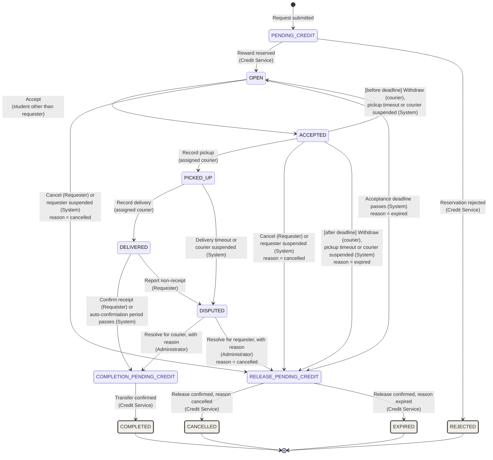

# State Table
**Order lifecycle.** The Order Service requirements refer to the states and transitions below. Any transition not listed is not permitted.

| State | Meaning | Final |
| ----- | ----- | :---: |
| PENDING\_CREDIT | The request is submitted and waiting for the Credit Service to reserve its reward. | No |
| OPEN | The reward is reserved and the order is waiting for a courier to accept it. | No |
| ACCEPTED | A courier is assigned and the order is waiting for pickup. | No |
| PICKED\_UP | The courier has collected the items and the order is waiting for delivery. | No |
| DELIVERED | The courier has recorded delivery and the order is waiting for the requester to confirm receipt or report non-receipt. | No |
| DISPUTED | Delivery could not be established and the order is waiting for an administrator decision. | No |
| COMPLETION\_PENDING\_CREDIT | Delivery is accepted and the order is waiting for the Credit Service to transfer the reward to the courier. | No |
| RELEASE\_PENDING\_CREDIT | The order is ending without payment and is waiting for the Credit Service to return the reward to the requester; the order records a release reason of cancelled or expired. | No |
| REJECTED | The reward could not be reserved and no credits are held. | Yes |
| COMPLETED | The reward has been transferred to the courier. | Yes |
| CANCELLED | The reward has been returned to the requester after a cancellation or a dispute resolved for the requester. | Yes |
| EXPIRED | The reward has been returned to the requester because the acceptance deadline passed without a courier keeping the order. | Yes |

# Transition Table
| From | Trigger | Actor | To |
| ----- | ----- | ----- | ----- |
| PENDING\_CREDIT | Reward reserved | Credit Service | OPEN |
| PENDING\_CREDIT | Reservation rejected | Credit Service | REJECTED |
| OPEN | Accept | Student other than the requester | ACCEPTED |
| OPEN | Cancel | Requester | RELEASE\_PENDING\_CREDIT (cancelled) |
| OPEN | Requester suspended | System | RELEASE\_PENDING\_CREDIT (cancelled) |
| OPEN | Acceptance deadline passes | System | RELEASE\_PENDING\_CREDIT (expired) |
| ACCEPTED | Record pickup | Assigned courier | PICKED\_UP |
| ACCEPTED | Cancel | Requester | RELEASE\_PENDING\_CREDIT (cancelled) |
| ACCEPTED | Requester suspended | System | RELEASE\_PENDING\_CREDIT (cancelled) |
| ACCEPTED | Withdraw, pickup timeout, or courier suspended, before the acceptance deadline | Assigned courier (withdraw) or System | OPEN |
| ACCEPTED | Withdraw, pickup timeout, or courier suspended, after the acceptance deadline | Assigned courier (withdraw) or System | RELEASE\_PENDING\_CREDIT (expired) |
| PICKED\_UP | Record delivery | Assigned courier | DELIVERED |
| PICKED\_UP | Delivery timeout or courier suspended | System | DISPUTED |
| DELIVERED | Confirm receipt | Requester | COMPLETION\_PENDING\_CREDIT |
| DELIVERED | Auto-confirmation period passes | System | COMPLETION\_PENDING\_CREDIT |
| DELIVERED | Report non-receipt | Requester | DISPUTED |
| DISPUTED | Resolve for courier, with reason | Administrator | COMPLETION\_PENDING\_CREDIT |
| DISPUTED | Resolve for requester, with reason | Administrator | RELEASE\_PENDING\_CREDIT (cancelled) |
| COMPLETION\_PENDING\_CREDIT | Transfer confirmed | Credit Service | COMPLETED |
| RELEASE\_PENDING\_CREDIT | Release confirmed, reason cancelled | Credit Service | CANCELLED |
| RELEASE\_PENDING\_CREDIT | Release confirmed, reason expired | Credit Service | EXPIRED |

# UML Diagram


---

## Running this service

Owned by **Zhang Yuan**. Implements the errand lifecycle from creation to a terminal state.

### Prerequisites

Node 22.12 or later (`nvm use` picks it up from `.nvmrc`). Install dependencies
once from the repository root — this is an npm workspace, so a per-service
`npm install` is neither needed nor correct:

```bash
npm install
```

### Commands

Run these from the repository root.

| Command                                   | What it does                  |
| ----------------------------------------- | ----------------------------- |
| `npm run dev:order`                       | Start with reload on change   |
| `npm run build -w @foc/order-service`     | Compile TypeScript to `dist/` |
| `npm test -w @foc/order-service`          | Run this service's tests      |
| `npm run typecheck -w @foc/order-service` | Type-check without emitting   |
| `npm run lint`                            | Lint every service            |

### Required environment

| Variable       | Example         | Notes                                   |
| -------------- | --------------- | --------------------------------------- |
| `SERVICE_NAME` | `order-service` | Tags every log line                     |
| `PORT`         | `3003`          | Bind port                               |
| `NODE_ENV`     | `development`   | `development` \| `test` \| `production` |
| `LOG_LEVEL`    | `info`          | Defaults to `info`                      |

A missing required variable stops the service at boot and names the variable.
Nothing falls back to an insecure default.

```bash
SERVICE_NAME=order-service PORT=3003 npm run dev:order
curl -i http://localhost:3003/health
```

### What you get from `@foc/platform`

Importing `PlatformModule.forRoot(...)` gives this service a `GET /health`
endpoint, structured JSON logging where every line carries a correlation ID,
request logging, a shared error envelope, and graceful shutdown on `SIGTERM`.
Do not re-implement these per service — extend the shared package instead, so a
change lands once rather than four times.

### Docker

```bash
docker build -f order-service/Dockerfile -t foc/order-service .
```

The build context is the **repository root**, not this folder, because the image
needs the workspace manifests and `@foc/platform`. The image runs as a non-root
user and declares a `HEALTHCHECK`. `compose.yaml` wiring arrives with PLT-02.

### Next tickets

ORD-01, ORD-02, ORD-03
